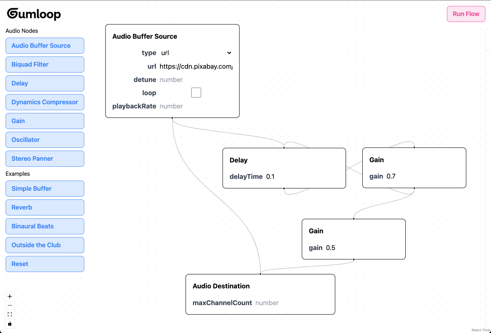

# Gumloop Coding Challenge (Solution)

This repository implements an interactive audio processing flow using the Web Audio API. The flow comprises several audio nodes, such as the AudioBufferSourceNode, DelayNode, and GainNode, connected to create a dynamic audio effect. Clicking the Run Flow button triggers audio playback, applying the configured effects.

Run the live version here: https://audio-context-explorer.netlify.app/

## Getting Started

1. Clone this repository

2. Install dependencies:

```bash
npm install # or `pnpm install` or `yarn install`
```

3. Start the development server:

```bash
npm run dev
```

## Submission

Include a link to your repo in your submission or give https://github.com/rbehal access. Email us at founders@gumloop.com if you have any issues.
